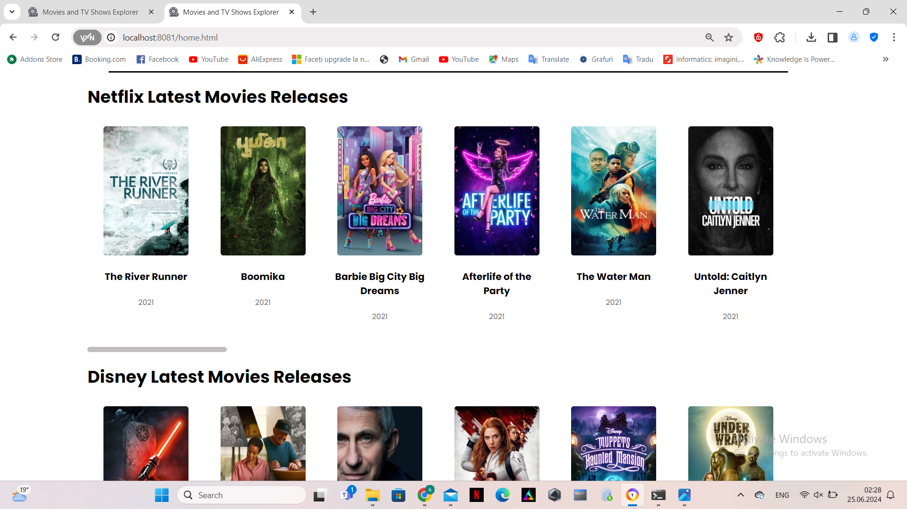

<!DOCTYPE html>
<html lang="ro">
<head>
    <meta charset="UTF-8">
    <meta name="viewport" content="width=device-width, initial-scale=1.0">
    <title>MoX (Movies and TV Shows Explorer)</title>
</head>
<body>
<article>
    <header>
        <h1>
             MoX (Movies and TV Shows Explorer)
        </h1>
    </header>
    <h2>Cuprins</h2>
    <ul>
        <li>
            <a href="#authors">Autori</a>
        </li>
        <li>
            <a href="#introduction">1. Introducere</a>
            <ul>
                <li><a href="#introduction-purpose">1.1 Scop</a></li>
                <li><a href="#conventions">1.2 Convenție de scriere</a></li>
                <li><a href="#audience">1.3 Publicul țintă</a></li>
                <li><a href="#product-scope">1.4 Scopul produsului</a></li>
                <li><a href="#references">1.5 Referințe</a></li>
            </ul>
        </li>
        <li><a href="#overall">2. Descriere Generală</a>
            <ul>
                <li><a href="#product-perspective">2.1 Perspectiva produsului</a></li>
                <li><a href="#product-functions">2.2 Funcțiile produsului</a></li>
                <li><a href="#users">2.3 Clase și caracteristici ale utilizatorilor</a></li>
                <li><a href="#operating-environment">2.4 Mediul de operare</a></li>
                <li><a href="#documentation">2.5 Documentația pentru utilizator</a></li>
            </ul>
        </li>
        <li><a href="#external">3. Interfețele aplicației </a>
            <ul>
                <li><a href="#user-interface">3.1 Interfața utilizatorului </a>
                    <ul>
                        <li><a href="#nav-bar">3.1.1 Bara de navigație </a></li>
                        <li><a href="#login-page">3.1.2 Pagina de autentificare </a></li>
                        <li><a href="#signup-page">3.1.3 Pagina de înregistrare </a></li>
                        <li><a href="#resetPassword-page">3.1.4 Pagina de resetarea a parolei </a></li>
                        <li><a href="#home-page">3.1.5 Pagina acasă </a></li>
                        <li><a href="#movies">3.1.6 Pagina de explorare a filmelor </a></li>
                        <li><a href="#tvShows">3.1.7 Pagina de explorare a serialelor </a></li>
                        <li><a href="movieTvShow-page">3.1.8 Pagina de vizualizare a informatiilor despre un anume film/serial </a></li>
                        <li><a href="#about">3.1.9 Pagina informativa </a></li>
                        <li><a href="#help">3.1.10 Pagina de ajutor </a></li>
                        <li><a href="#profile">3.1.11 Pagina de profil </a></li>
                        <li><a href="#error400">3.1.12 Pagina 400 </a></li>
                        <li><a href="#error404">3.1.13 Pagina 404 </a></li>
                        <li><a href="#admin">3.1.14 Pagina administratorului </a></li>
                        <li><a href="#changepass">3.1.15 Pagina de schimbare a parolei </a></li>
                    </ul>
                </li>
                <li><a href="#hardware-interface">3.2 Interfața Hardware </a></li>
                <li><a href="#software-interface">3.3 Interfața Software</a></li>
                <li><a href="#communication-interface">3.4 Interfața de comunicare</a></li>
            </ul>
        </li>
        <li><a href="#system-features">4. Caracteristici ale sistemului</a>
            <ul>
                <li><a href="#management">4.1 Gestionarea contului </a>
                    <ul>
                        <li><a href="#management-1">4.1.1 Descriere și generalități </a></li>
                        <li><a href="#management-2">4.1.2 Actualizarea informațiilor</a></li>
                        <li><a href="#management-3">4.1.3 Condiții de funcționare</a></li>
                    </ul>
                </li>
                <li><a href="#utilizatori">4.2 Secțiunea Utilizatori</a>
                    <ul>
                        <li><a href="#utilizatori-1">4.2.1 Descriere și generalități</a></li>
                        <li><a href="#utilizatori-2">4.2.2 Actualizarea informațiilor</a></li>
                        <li><a href="#utilizatori-3">4.2.3 Condiții de funcționare</a></li>
                    </ul>
                </li>
                <li><a href="#administrator">4.3 Secțiunea Admin</a>
                    <ul>
                        <li><a href="#administrator-1">4.3.1 Descriere și generalități</a></li>
                        <li><a href="#administrator-2">4.3.2 Actualizarea informațiilor</a></li>
                        <li><a href="#administrator-3">4.3.3 Condiții de funcționare</a></li>
                    </ul>
                </li>
                <li><a href="#logout">4.4 Secțiunea Logout</a>
                    <ul>
                        <li><a href="#logout-1">4.4.1 Descriere și generalități</a></li>
                        <li><a href="#logout-2">4.4.2 Actualizarea informațiilor</a></li>
                        <li><a href="#logout-3">4.4.3 Condiții de funcționare</a></li>
                    </ul>
                </li>
                <li><a href="#other">4.5 Alte funcționalități </a>
                    <ul>
                        <li><a href="#other-1">4.5.1 Descriere și generalități</a></li>
                        <li><a href="#other-2">4.5.2 Actualizarea informațiilor</a></li>
                        <li><a href="#other-3">4.5.3 Condiții de funcționare</a></li>
                    </ul>
                </li>
            </ul>
        </li>
        <li><a href="#non-functional">5.Funcționalități pentru protecție și securitate</a>
            <ul>
                <li><a href="#safety">5.1 Protecția datelor</a></li>
                <li><a href="#security">5.2 Securizarea datelor</a></li>
                <li><a href="#software-attributes">5.3 Calitățile Software </a></li>
            </ul>
        </li>
    </ul>
    

        <section id="authors" typeof="sa:AuthorsList">
            <h2>Autori</h2>
            <ul>
                <li property="schema:author" typeof="sa:ContributorRole">
            
              <meta content="Ana" property="schema:givenName">
              <meta content="Maria" property="schema:additionalName">
              <meta content="Ungureanu" property="schema:familyName">
              Ungureanu Ana-Maria
            
                    <ul>
                        <li property="schema:roleContactPoint" typeof="schema:ContactPoint">
                            <a href="mailto:anaungureanu2003@gmail.com" property="schema:email">anaungureanu2003@gmail.com</a>
                        </li>
                    </ul>
                </li>
                <li property="schema:author" typeof="sa:ContributorRole">
            
              <meta content="Catalina" property="schema:givenName">
              <meta content="Hohleva" property="schema:familyName">
              Hohleva Catalina
            
                    <ul>
                        <li property="schema:roleContactPoint" typeof="schema:ContactPoint">
                            <a href="mailto:hohlevac@gmail.com" property="schema:email">hohlevac@gmail.com</a>
                        </li>
                    </ul>
            </ul>
        </section>
    

    <section id="introduction">
        <h3>1. Introducere</h3>
        <section id="introduction-purpose">
            <h4>1.1 Scop</h4>
            

                MoX (Movies and TV Shows Explorer) este o aplicație web dezvoltată de studenții menționați în secțiunea
                de Autori de la Facultatea de
                Informatică a Universității Alexandru Ioan Cuza.
                Scopul acestui document este acela de a prezenta o descriere detaliată a funcționalităților, precum și de
                a specifica cerințele aplicației web. Această aplicație
                va oferi utilizatorilor posibilitatea explorarii unei diversitati de filme si seriale disponibile pentru 
                vizionare pe platformele de streaming Netflix + Disney, de vizualizare a 
                informatiilor referitoare la un anume film/serial. De asemenea, utilizatorului îi sunt
                disponibile o serie de filtre pentru cautarea sau sortarea mai eficienta a elementelor.
            

        </section>
        <section id="conventions">
            <h4> 1.2 Convenția documentului</h4>
            <ul>
                <li>
                    Acest document urmează șablonul de documentație a cerințelor software conform IEEE Software
                    Requirements
                    Specification.
                </li>
                <li>
                    Textul <b>îngroșat</b> este folosit pentru a defini noțiuni personalizate sau pentru a accentua
                    concepte
                    importante.
                </li>
            </ul>
        </section>
        <section id="audience">
            <h4>1.3 Publicul țintă</h4>
            

                Acest document este destinat tuturor personelor care fie ca sunt pasionati de tipul acesta de continut,
                fie cauta o informatie specifica, însă orice utilizator,
                indiferent
                de cunoștințele lor tehnologice,
                poate consulta secțiunile de <b>Interfeța utilizatorului</b> și <b>Caracteristici ale sistemului</b>
                pentru a
                obține o mai bună înțelegere a ceea ce oferă aplicația.
            

        </section>
        <section id="product-scope">
            <h4>1.4 Scopul Produsului</h4>
            

                Scopul principal al produsului este de a oferi utilizatorilor o modalitate 
                simplă și captivantă de a explora și înțelege conținutul disponibil pe platformele
                de streaming Netflix și Disney, oferindu-le în același timp instrumente puternice
                pentru analiza și înțelegerea datelor asociate acestui conținut. Prin integrarea
                cu TMDb și oferirea de funcționalități avansate de căutare și filtrare, MoX le 
                permite utilizatorilor să descopere rapid și să se angajeze cu conținutul care le 
                interesează cel mai mult. De asemenea, utilizatorii își pot crea un cont
                pentru a beneficia de restul funcționalităților MoX.
            

        </section>
        <section id="references">
            <h4>1.5 Bibliografie</h4>
            <ul>
                <li>Buraga Sabin-Corneliu, Site-ul Tehnologii Web, FII UAIC</li>
                <li>H Rick. IEEE-Template - GitHub</li>
            </ul>
        </section>
    </section>
    <section id="overall">
        <h3>2. Descriere Generală</h3>
        <section id="product-perspective">
            <h4>2.1 Perspectiva produsului</h4>
            
MoX (Movies and TV Shows Explorer), este o platformă web care integrează datele de la 
               serviciile de streaming Netflix și Disney, corelate cu informații suplimentare disponibile
               in The Movie Database (TMDb). Scopul său este de a oferi utilizatorilor o experiență 
               interactivă și informativă privind conținutul disponibil pe aceste platforme, îmbogățită 
               cu statistici și vizualizări relevante.
        </section>
        <section id="product-functions">
            <h4>2.2 Funcționalitățile produsului</h4>
            Fiecare utilizator va avea acces la urmatoarele funcționălități:
            <ul>
                <li>să se înregistreze pe site.</li>
                <li>să se autentifice pe site.</li>
                <li>să își reseteze parola in cazul in care a uitat-o.</li>
                <li>să consulte pagină "Home(MTSE)" și noutățile disponibile</li>
                <li>să acceseze paginile "Movies" si "TvShows" pentru a accesa o lista de filme sau seriale, 
                     ce pot fi filtrate ulterior
                </li>
                <li>să acceseze pagina "About Us" pentru a accesa scurtă descriere a paginii web</li>
                <li>să acceseze pagina "Help" pentru a beneficia de sfaturi în vederea utilizării aplicației</li>
                <li>dacă este <b>autentificat</b>, să își acceseze profilul și sa verifice statisticile personale</li>
                <li>dacă utilizatorul are rol de <b>admin</b>, acesta poate șterge utilizatori din baza de date</li>
                <li>dacă utilizatorul are rol de <b>admin</b>, acesta poate adăuga filme/seriale noi</li>
                <li>dacă utilizatorul are rol de <b>admin</b>, acesta poate modifica informatii despre date deja
                    existente.
                </li>
            </ul>
        </section>
        <section id="users">
            <h4>2.3 Clase și caracteristici ale utilizatorilor</h4>
            <h5>2.3.1 Utilizator principal</h5>
            <ul>
                <li>utilizatorii autentificați pot fi:</li>
                <li style="list-style: none">
                    <ul>
                        <li>pasioanti care doresc sa tina o evidenta a filmelor/serialelor vizionate. Ei au 
                            acces la funcționalități suplimentare și pot beneficia de caracteristici 
                            personalizate, cum ar fi salvarea preferințelor, crearea de liste de vizionare 
                            sau participarea la comunitatea platformei prin postarea de recenzii și ratinguri.
                        </li>
                    </ul>
                </li>
                <li>
                    utilizatorii neautentificați pot fi:
                    <ul>
                        <li>orice categorie de oameni care fie ca sunt pasionati de tipul acesta de continut,
                            fie cauta o informatie specifica. Aceștia pot fi utilizatori noi care explorează 
                            platforma pentru prima dată sau persoane care nu doresc să-și creeze un cont.
                        </li>
                    </ul>
                </li>
            </ul>
            <h5>2.3.2 Caracteristici</h5>
            <ul>
                <li>Utilizatorii care sunt <b> autentificați </b> pot accesa pagina "My Profile", "Movies", "TvShows",
                    dar și cele două pagini ce oferă detalii și sfaturi cu privire la aplicație, "About Us" și "Help".
                    Mai mult, aceștia pot lăsa recenzii și ratinguri pentru filmele și serialele pe care le-au vizionat. 
                    Aceste recenzii și ratinguri pot fi vizualizate de alți utilizatori și pot ajuta la recomandări 
                    personalizate. De asemenea, pot să monitorizeze statistici, acestea fiind salvate la profilul
                    fiecărui utilizator.
                </li>
                <li>Utilizatorii neautentificați pot naviga și explora conținutul paginii de filme și seriale fără a fi 
                    nevoie să se autentifice. Aceștia pot vedea lista de filme și seriale disponibile pe platformă, pot 
                    căuta filme și seriale în funcție de anumite criterii de bază, cum ar fi genul sau anul de lansare.
                    De asemenea, pot accesa paginile individuale ale fiecărui film sau serial pentru a vedea mai multe 
                    detalii și pentru a vizualiza trailerul, imagini. Așadar, aceștia pot să se înregistreze ca și 
                    utilizator și să beneficieze de toate funcționalitățile.
                </li>
            </ul>
        </section>
        <section id="operating-environment">
            <h4>2.4 Mediul de operare</h4>
            

                Produsul dezvoltat poate fi utilizat pe orice dispozitiv cu un browser web care suportă HTML5, CSS și
                JavaScript.
            

        </section>
        <section id="documentation">
            <h4>2.5 Documentația pentru utilizator</h4>
            

                Utilizatorii pot consulta acest document pentru explicații detaliate despre funcționalitățile aplicației
                web.
            

        </section>
    </section>
    <section id="external">
        <h3>3. Interfețele aplicației</h3>
        <section id="user-interface">
            <h4>3.1 Interfața utilizatorului</h4>
            Mai jos, puteți vedea o prezentare generală a fiecărei pagini a aplicației și funcționalităților pe care le
            oferă:
            <ul>
                <li id="nav-bar"><b>Bara de navigație</b></li>
                <li style="list-style: none">
                    <ul>
                        <li>Aceasta reprezintă meniul de navigare către fiecare pagina a aplicației, prezent pe fiecare
                            pagină totodată.
                        </li>
                        <li class="pictures" style="list-style: none"></li>
                    </ul>
                </li>
                <li id="login-page"><b>Pagina de autentificare</b></li>
                <li style="list-style: none">
                    <ul>
                        <li>Pagina are rolul de a realiza autentificarea utilizatorilor la MoX.</li>
                        <li>Pentru a se autentifica, utilizatorul trebuie să completeze câmpurile de "email" și
                            "password" cu
                            credențiale <b>valide</b>, urmând să acționeze butonul <b>Sign in</b>.
                        </li>
                        <li> În cazul în care utilizatorul nu are cont pe site, acesta își poate crea unul prin
                            accesarea pagini de
                            înregistrare, ce se face prin apăsarea butonului <b>Create new MTSE account</b>.
                        </li>
                        <li> În cazul în care utilizatorul și-a uitat parola, acesta poate să o reseteze selectând
                            opțiunea de
                            <b> Forgot your password? </b></li>
                        <li> De asemenea, utilizatorul are posibilitatea de a-si salva contul pentru o autentificare
                            ulterioarea selectand optiunea de 
                            <b> Remember me </b></li>
                        <li class="pictures" style="list-style: none">
                        </li>
                    </ul>
                </li>
                <li id="signup-page"><b>Pagina de înregistrare</b></li>
                <li style="list-style: none">
                    <ul>
                        <li>Pagina oferă funcționalitatea de înregistrare a utilizatorilor, pentru a putea beneficia de
                            toate
                            funcționalitățile RoT.
                        </li>
                        <li>Pentru a se înregistra, utilizatorul trebuie să completeze câmpurile <b>Email</b>,
                            <b>Username</b>, <b>Password</b> si <b>Re-Enter Password</b>. Mai mult, câmpurile <b>Email</b> și
                            <b>Username</b>
                            trebuie să fie <b>unice</b>.
                        </li>
                        <li>În cazul în care utilizatorul își amintește că are un cont existent, acesta poate apasă
                            butonul
                            <b>Sign in</b> aflat în partea de jos a formularului, sau pe butonul <b>Login</b> din
                            coltul din dreapta-sus
                            al paginii, pentru a reveni la meniul de autentificare.
                        </li>
                        <li class="pictures" style="list-style: none">
                    </ul>
                </li>
                <li id="resetPassword-page"><b>Pagina de de resetare a parolei prin mail</b></li>
                <li style="list-style: none">
                    <ul>
                        <li> Pagina are rolul de a trimite un email către utilizator, care îl va redirecționa spre o
                            pagină nouă, unde care
                            își va introduce nouă parolă. La apăsarea butonului de <b> Continue </b>, utilizatorul
                            va fi redirecționat
                            către pagină de autentificare.
                        </li>
                        <li class="pictures" style="list-style: none"></li>
                    </ul>
                </li>
                <li id="home-page"><b> Pagina acasă</b></li>
                <li style="list-style: none">
                    <ul>
                        <li>Pagina are rolul de prezența ultimele tendinte, ultimele trailere lansate, filme si seriale populare.</li>
                        <li class="pictures" style="list-style: none">
                        </li>
                        <li class="pictures" style="list-style: none">
                        </li>
                        <li class="pictures" style="list-style: none">
                        </li>
                        <li class="pictures" style="list-style: none">
                        </li> 
                    </ul>
                </li>
                <li id="movies"><b> Pagina de explorare a filmelor </b></li>
                <li style="list-style: none">
                    <ul>
                        <li>Pagina prezintă o listă extinsă de filme disponibile pe platforma MoX. Fiecare titlu
                           de film este însoțit de detalii relevante, cum ar fi imaginea de copertă, titlul, data 
                           de lansare. Utilizatorii au posibilitatea să efectueze căutări rapide sau să aplice 
                           filtre avansate pentru a rafina rezultatele în funcție de preferințe specifice, 
                           cum ar fi genul, platforma de vizionare, anul de lansare, etc. Ei pot accesa paginile 
                           individuale ale fiecărui film pentru a vedea mai multe detalii, inclusiv trailerul, 
                           recenzii și ratinguri de la alți utilizatori. Utilizatorii pot lăsa recenzii și ratinguri 
                           pentru filmele vizionate.
                        </li>
                        <li class="pictures" style="list-style: none">
                        </li>
                        <li class="pictures" style="list-style: none">
                        </li>
                        <li class="pictures" style="list-style: none">
                        </li>
                    </ul>
                </li>
                <li id="tvShows"><b> Pagina de explorare a serialelor </b></li>
                <li style="list-style: none">
                    <ul>
                        <li>Pagina oferă o prezentare detaliată a serialelor disponibile pe platforma MoX, organizate 
                           într-un mod care facilitează navigarea și explorarea. Utilizatorii au posibilitatea să 
                           efectueze căutări rapide sau să aplice filtre avansate pentru a rafina rezultatele 
                           în funcție de preferințe specifice, 
                           cum ar fi genul, platforma de vizionare, anul de lansare, etc. Ei pot accesa paginile 
                           individuale ale fiecărui serial pentru a vedea mai multe detalii, inclusiv trailerul, 
                           recenzii și ratinguri de la alți utilizatori. Utilizatorii pot lăsa recenzii și ratinguri 
                           pentru serialele vizionate.
                        </li>
                        <li class="pictures" style="list-style: none">
                        </li>
                        <li class="pictures" style="list-style: none">
                        </li>
                        <li class="pictures" style="list-style: none">
                        </li>
                    </ul>
                <li id="movieTvShow-page"><b> Pagina de vizualizare a informatiilor despre un anume film/serial</b></li>
                <li style="list-style: none">
                    <ul>
                        <li>Pagina conține semne rutiere atât din țară noastră, cât și din alte cinci țări.</li>
                        <li> Pentru a accesa semnele din România, se va face click pe steag, urmând să se selecteze în
                            mod specific
                            categoria de semne dorită spre a fi văzută. Apăsând pe oricare dintre cele 5 steaguri
                            străine, se va deschide
                            o listă cu semnele de circulație corespunzătoare.
                        </li>
                        <li class="pictures" style="list-style: none"></li>
                        <li class="pictures" style="list-style: none"></li>
                        <li class="pictures" style="list-style: none"></li>
                        <li class="pictures" style="list-style: none"></li>
                    </ul>
                </li>
                <li id="about"><b>Pagina informativa</b></li>
                <li style="list-style: none">
                    <ul>
                        <li>Pagina are rolul de a introduce site-ul MTSE pe scurt, prin menționarea unor mici detalii:
                            numele autorilor, rolul aplicației.
                        </li>
                        <li class="pictures" style="list-style: none">
                        </li>
                        <li class="pictures" style="list-style: none">
                        </li>
                    </ul>
                <li id="help"><b>Pagina de ajutor</b></li>
                <li style="list-style: none">
                    <ul>
                        <li>Pagina are rolul de a oferi utilizatorului posibilitatea de a pune intrebari, ulterior oferindu-i-se 
                           sfaturi pentru a putea beneficia de o experienta completa pe site.
                        </li>
                        <li class="pictures" style="list-style: none">
                        </li>
                    </ul>
                <li id="profile"><b>Pagina de profil</b></li>
                <li style="list-style: none">
                    <ul>
                        <li>Urmeaza a fi implementata.</li>
                        <li>Pagina va prezinta informații despre utilizator.</li>
                        <li>Utilizatorii vor vedea informații despre propriul cont, cum ar fi numele de utilizator,
                          adresă de email și alte detalii de profil pe care le-au furnizat la înregistrare. 
                          Utilizatorii pot vedea recenziile și ratingurile pe care le-au lăsat pentru filmele și 
                          serialele pe care le-au vizionat. Acestea pot fi vizualizate atât de utilizatorul însuși, 
                          cât și de alți utilizatori care accesează profilul său.
                        </li>
                        <li>Mai mult, utilizatorul va avea la dispoziție un buton <b>Logout</b> prin care poate ieși din
                            cont,
                            dar is unul <b>Change Password</b>, în cazul în care își dorește acest lucru.
                        </li>
                    </ul>
                </li>
                <li id="error400"><b>Pagina 400</b></li>
                <li style="list-style: none">
                    <ul>
                        <li>Urmeaza a fi implementata.</li>
                        <li>Pagina va afișeaza eroarea <b>400 Cerere greșită</b>.</li>
                    </ul>
                </li>
                <li id="error404"><b>Pagina 404</b></li>
                <li style="list-style: none">
                    <ul>
                        <li>Urmeaza a fi implementata.</li>
                        <li>Pagina va afișeaza eroarea <b>404 Cerere greșită</b>.</li>
                    </ul>
                </li>
                <li id="admin"><b>Pagina Administratorului</b></li>
                <li style="list-style: none">
                    <ul>
                        <li>Urmeaza a fi implementata.</li>
                        <li>Pagina va afișeaza interfață pentru <b>adminstrator</b>.</li>
                        <li>Administratorul are capacitatea de a adauga noi filme/seriale, de a modifica
                            informatii despre date deja existente și de a șterge utilizatori din baza de date.
                        </li>
                    </ul>
                </li>
                <li id="changepass"><b>Pagina de schimbare a parolei</b></li>
                <li style="list-style: none">
                    <ul>
                        <li>Urmeaza a fi implementata.</li>
                        <li>Pagină afișează un formular numit <b>Reset Password</b>, unde se vor completa corespunzător
                            câmpurile
                            pentru a schimbă parolă veche cu cea nouă.
                        </li>
                        <li>Se va primi un mesaj ce confirmă această schimbare, putând reveni la profil prin acționarea
                            butonului
                            <b>Continue</b>.
                        </li>
                    </ul>
                </li>
            </ul>
            <section id="hardware-interface">
                <h4>3.2 Interfața Hardware</h4>
                

                    Acest produs nu necesită interfețe hardware, funcționând pe orice platformă (calculatoare,
                    laptopuri,
                    telefoane etc.), care are instalată un browser.
                

            </section>
            <section id="software-interface">
                <h4>3.3 Interfața Software</h4>
                

                    Cerințele minime de software includ un browser funcțional, compatibil cu HTML5 și cu JavaScript.
                <h5>Postgres Database</h5>
                Aceasta va reprezinta baza de date în care stocăm informații despre fiecare utilizator, film si
                serial.
            </section>
            <section id="communication-interface">
                <h4>3.4 Interfața de comunicare</h4>
                

                    Aplicația necesită o conexiune la internet. Standardul de comunicare care va fi utilizat este HTTP.
                

            </section>
            <section id="system-features">
                <h3>4. Caracteristici ale sistemului</h3>
                <section id="management">
                    <h4>4.1 Gestionarea contului</h4>
                    <h5 id="management-1">4.1.1 Descriere și generalități</h5>
                    Un utilizator se poate înregistra alegându-și un nume de utilizator, un email si o parola.
                    Acesta se poate
                    autentifica având nevoie doar de numele de email și de parolă.
                    <h5 id="management-2">4.1.2 Actualizarea informațiilor</h5>
                    <ul>
                        <li>
                            În momentul în care un utilizator nou este creat, credențialele acestuia sunt introduse în
                            baza de
                            date. De asemenea, când utilizatorul decide să-și modifice credențialele, noile valori sunt
                            și ele
                            actualizate în baza de date.
                        </li>
                    </ul>
                    <h5 id="management-3">4.1.3 Condiții de funcționare</h5>
                    <ul>
                        <li>
                            Pentru a-și modifica credențialele utilizatorul, trebuie să fie autentificat.
                        </li>
                        <li>
                            Pentru a se autentifica, utilizatorul are nevoie de un cont care este înregistrat în baza de
                            date.
                        </li>
                    </ul>
                </section>
                <section id="utilizatori">
                    <h4>4.2 Secțiunea de utilizatori</h4>
                    <h5 id="utilizatori-1">4.2.1 Descriere și generalități</h5>
                    Secțiunea <b>Utilizatori</b> este destinată
                    <b>adminului</b>, și aceasta îi oferă posibilitatea
                    de a vizualiza o listă cu toți utilizatorii din
                    baza de date. De asemenea, acesta are posibilitatea
                    de a elimina utilizatori din baza de date, dacă
                    dorește acest lucru.
                    <h5 id="utilizatori-2">4.2.2 Actualizarea informațiilor</h5>
                    <ul>
                        <li>
                            La apăsarea butonului de ștergere din dreptul fiecărui utilizator, credențialele
                            utilizatorului care a
                            fost selectat, sunt șterse din baza de date.
                        </li>
                    </ul>
                    <h5 id="utilizatori-3">4.2.3 Condiții de funcționare</h5>
                    <ul>
                        <li>
                            Utilizatorul trebuie să fie autentificat.
                        </li>
                        <li>
                            Utilizatorul trebuie să dețină drepturi de admin.
                        </li>
                    </ul>
                </section>
                <section id="administrator">
                    <h4>4.3 Secțiunea Admin</h4>
                    <h5 id="administrator-1">4.3.1 Descriere și generalități</h5>
                    Secțiunea <b>Admin</b> este destinată utilizatorilor ce au drepturi de <b>administrator</b> și
                    această
                    oferă facilități pe care un utilizator normal nu le are. În momentul în care adminul accesează
                    panoul de control,
                    va putea adaugă noi filme/seriale, modifică informatii referitoare la datele deja existente direct 
                    de pe platforma. Totodată, acesta este
                    capabil să șteargă
                    conturi ale utilizatorilor.
                    <h5 id="administrator-2">4.3.2 Actualizare informațiilor</h5>
                    <ul>
                        <li>
                            În momentul în care adminul adaugă noi filme/seriale, informațiile despre
                            acestea sunt inserate
                            în baza de
                            date.
                        </li>
                        <li>
                            În momentul în care adminul sau modifică informatii referitoare la 
                            datele deja existent pe platforma, informațiile despre
                            acestea sunt
                            actualizate în baza de
                            date.
                        </li>
                    </ul>
                    <h5 id="administrator-3">4.3.3 Condiții de funcționare</h5>
                    <ul>
                        <li>
                            Utilizatorul trebuie să fie autentificat.
                        </li>
                        <li>
                            Utilizatorul trebuie să dețină drepturi de admin.
                        </li>
                    </ul>
                </section>
                <section id="logout">
                    <h4>4.4 Secțiunea de Logout</h4>
                    <h5 id="logout-1">4.4.1 Descriere și generalități</h5>
                    Secțiunea de <b>Logout</b> are rolul de a deconecta utilizatorul de pe cont și îl redirecționează
                    către
                    pagina acasă.
                    <h5 id="logout-2">4.4.2 Actualizare informațiilor</h5>
                    <ul>
                        <li>
                            Tokenul de autentificare este eliminat, prin intermediul JWT.
                        </li>
                    </ul>
                    <h5 id="logout-3">4.4.3 Condiții de funcționare</h5>
                    <ul>
                        <li>
                            Utilizatorul trebuie să fie autentificat.
                        </li>
                    </ul>
                </section>
                <section id="other">
                    <h4>4.5 Alte funcționalități</h4>
                    <h5 id="other-1">4.6.1 Descriere și generalități</h5>
                    In cadrul paginii "Leaderboard", poate fi vzut un clasament ce tine evidenta celor mai harnici utilizatori
                    de pe site.
                    <h5 id="other-2">4.5.2 Actualizarea informațiilor</h5>
                    <ol>
                        <li>
                            Datele folosite sunt extrase pe baza unui camp actualizat permanent
                            din baza de date.
                        </li>
                    </ol>
                    <h5 id="other-3">4.5.3 Cerințe de funcționare</h5>
                    <ul>
                        <li>
                            Utilizatorul trebuie să fie autentificat.
                        </li>
                    </ul>
                </section>
            </section>
            <section id="non-functional">
                <h3>5. Funcționalități pentru protecție și securitate</h3>
                <section id="safety">
                    <h4>5.1 Protecția datelor</h4>
                    

                        Aplicația va asigura confidențialitatea datelor prin intermediul unei criptări.
                    

                </section>
                <section id="security">
                    <h4>5.2 Securizarea datelor</h4>
                    

                        Autorizarea utilizatorilor se face pe baza standardului JWT. Utilizatorii au acces doar la
                        informații legate
                        de progresul in cadrul site-ului, celelalte informații fiind ascunse. Token-ul folosit pentru
                        autorizare este
                        stocat intr-un cookie de tip HTTP-only, lucru care previne atacurile de tip XSS. Mai mult, toate
                        datele sunt introduse
                        in baza de date prin intermediul unor <b>prepared statements</b>, care asigura prevenirea SQL
                        Injection.
                    

                </section>
                <section id="software-attributes">
                    <h4>5.3 Calitățile Software</h4>
                    <ul>
                        <li>Adaptabilitate</li>
                        <li>Ușurință în utilizare</li>
                        <li>Flexibilitate</li>
                    </ul>
                </section>
            </section>
        </section>
    </section>
</article>
</body>
</html>
