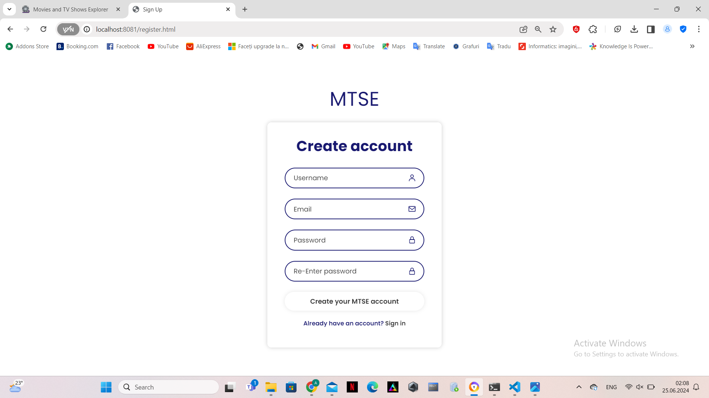
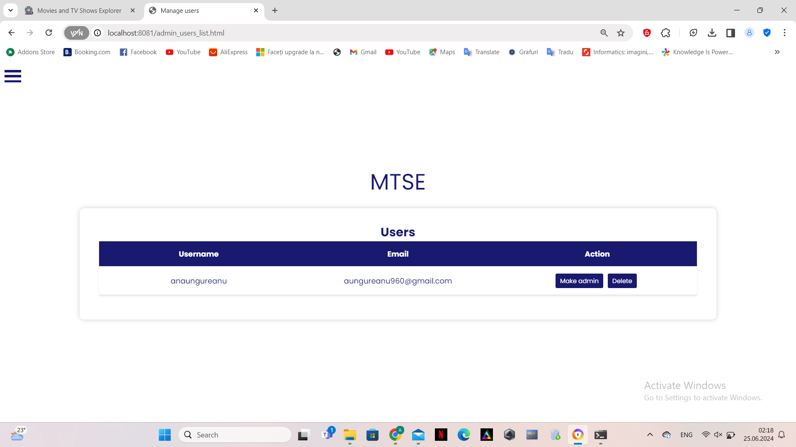
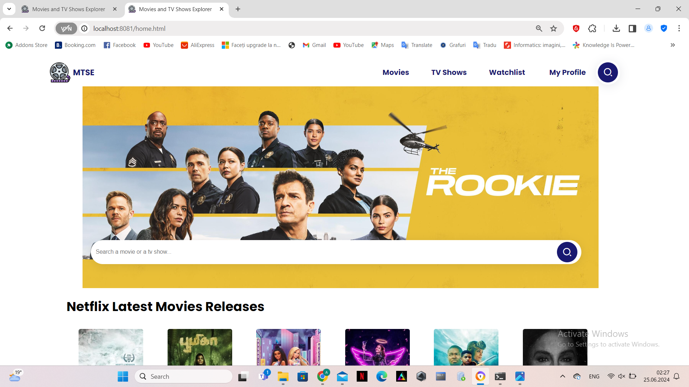
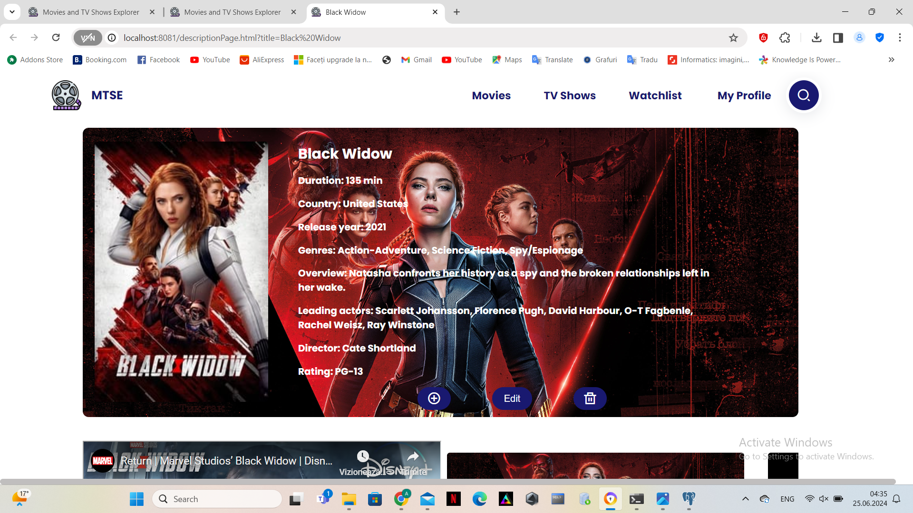

<!DOCTYPE html>
<html lang="ro">
<head>
    <meta charset="UTF-8">
    <meta name="viewport" content="width=device-width, initial-scale=1.0">
</head>
<body>
<article>
    <header>
        <h1>
             MoX (Movies and TV Shows Explorer)
        </h1>
    </header>
    <h2>Cuprins</h2>
    <ul>
        <li>
            <a href="#authors">Autori</a>
        </li>
        <li>
            <a href="#introduction">1. Introducere</a>
            <ul>
                <li><a href="#introduction-purpose">1.1 Scop</a></li>
                <li><a href="#conventions">1.2 Convenție de scriere</a></li>
                <li><a href="#audience">1.3 Publicul țintă</a></li>
                <li><a href="#product-scope">1.4 Scopul produsului</a></li>
                <li><a href="#references">1.5 Referințe</a></li>
            </ul>
        </li>
        <li><a href="#overall">2. Descriere Generală</a>
            <ul>
                <li><a href="#product-perspective">2.1 Perspectiva produsului</a></li>
                <li><a href="#product-functions">2.2 Funcțiile produsului</a></li>
                <li><a href="#users">2.3 Clase și caracteristici ale utilizatorilor</a></li>
                <li><a href="#operating-environment">2.4 Mediul de operare</a></li>
                <li><a href="#documentation">2.5 Documentația pentru utilizator</a></li>
            </ul>
        </li>
        <li><a href="#external">3. Interfețele aplicației </a>
            <ul>
                <li><a href="#user-interface">3.1 Interfața utilizatorului </a>
                    <ul>
                        <li><a href="#nav-bar">3.1.1 Bara de navigație </a></li>
                        <li><a href="#login-page">3.1.2 Pagina de autentificare </a></li>
                        <li><a href="#signup-page">3.1.3 Pagina de înregistrare </a></li>
                        <li><a href="#resetPassword-page">3.1.4 Pagina de resetarea a parolei </a></li>
                        <li><a href="#editAccount-page">3.1.5 Pagina de editare a contului </a></li>
                        <li><a href="#deleteAccount-page">3.1.6 Pagina de stergere a contului </a></li>
                        <li><a href="#signout-page">3.1.7 Pagina de deconectare</a></li>
                        <li><a href="#manageUsers-page">3.1.8 Pagina de administrare a utilizatorilor</a></li>
                        <li><a href="#addMovie-page">3.1.9 Pagina de adaugare a unui film sau serial</a></li>
                        <li><a href="#watchlist-page">3.1.10 Pagina de vizualizare a watchlist-ului</a></li>
                        <li><a href="#home-page">3.1.11 Pagina acasă</a></li>
                        <li><a href="#movies">3.1.12 Pagina de explorare a filmelor </a></li>
                        <li><a href="#tvShows">3.1.13 Pagina de explorare a serialelor </a></li>
                        <li><a href="#movieTvShow-page">3.1.14 Pagina de vizualizare a informatiilor despre un specific film sau serial </a></li>
                        <li><a href="#actor-page">3.1.15 Pagina de vizualizare a informatiilor despre un specific actor </a></li>
                        <li><a href="#statistics-page">3.1.16 Pagina de vizualizare a statisticilor </a></li>
                        <li><a href="#search-page">3.1.16 Pagina de cautare </a></li>
                        <li><a href="#editMovie-page">3.1.17 Pagina de editare a informatiilor unui film sau serial </a></li>
                        <li><a href="#deleteMovie-page">3.1.18 Pagina de stergere a unui film sau serial </a></li>
                        <li><a href="#about">3.1.19 Pagina informativa </a></li>
                        <li><a href="#help">3.1.20 Pagina de ajutor </a></li>
                    </ul>
                </li>
                <li><a href="#hardware-interface">3.2 Interfața Hardware </a></li>
                <li><a href="#software-interface">3.3 Interfața Software</a></li>
                <li><a href="#communication-interface">3.4 Interfața de comunicare</a></li>
            </ul>
        </li>
        <li><a href="#system-features">4. Caracteristici ale sistemului</a>
            <ul>
                <li><a href="#management">4.1 Gestionarea contului </a>
                    <ul>
                        <li><a href="#management-1">4.1.1 Descriere și generalități </a></li>
                        <li><a href="#management-2">4.1.2 Actualizarea informațiilor</a></li>
                        <li><a href="#management-3">4.1.3 Condiții de funcționare</a></li>
                    </ul>
                </li>
                <li><a href="#utilizatori">4.2 Secțiunea Utilizatori</a>
                    <ul>
                        <li><a href="#utilizatori-1">4.2.1 Descriere și generalități</a></li>
                        <li><a href="#utilizatori-2">4.2.2 Actualizarea informațiilor</a></li>
                        <li><a href="#utilizatori-3">4.2.3 Condiții de funcționare</a></li>
                    </ul>
                </li>
                <li><a href="#administrator">4.3 Secțiunea Admin</a>
                    <ul>
                        <li><a href="#administrator-1">4.3.1 Descriere și generalități</a></li>
                        <li><a href="#administrator-2">4.3.2 Actualizarea informațiilor</a></li>
                        <li><a href="#administrator-3">4.3.3 Condiții de funcționare</a></li>
                    </ul>
                </li>
                <li><a href="#logout">4.4 Secțiunea Logout</a>
                    <ul>
                        <li><a href="#logout-1">4.4.1 Descriere și generalități</a></li>
                        <li><a href="#logout-2">4.4.2 Actualizarea informațiilor</a></li>
                        <li><a href="#logout-3">4.4.3 Condiții de funcționare</a></li>
                    </ul>
                </li>
                <li><a href="#other">4.5 Alte funcționalități </a>
                    <ul>
                        <li><a href="#other-1">4.5.1 Descriere și generalități</a></li>
                        <li><a href="#other-2">4.5.2 Actualizarea informațiilor</a></li>
                        <li><a href="#other-3">4.5.3 Condiții de funcționare</a></li>
                    </ul>
                </li>
            </ul>
        </li>
        <li><a href="#non-functional">5.Funcționalități pentru protecție și securitate</a>
            <ul>
                <li><a href="#safety">5.1 Protecția datelor</a></li>
                <li><a href="#security">5.2 Securizarea datelor</a></li>
                <li><a href="#software-attributes">5.3 Calitățile Software </a></li>
            </ul>
        </li>
    </ul>
    

        <section id="authors" typeof="sa:AuthorsList">
            <h2>Autori</h2>
            <ul>
                <li property="schema:author" typeof="sa:ContributorRole">
            
              <meta content="Ana" property="schema:givenName">
              <meta content="Maria" property="schema:additionalName">
              <meta content="Ungureanu" property="schema:familyName">
              Ungureanu Ana-Maria
            
                    <ul>
                        <li property="schema:roleContactPoint" typeof="schema:ContactPoint">
                            <a href="mailto:anaungureanu2003@gmail.com" property="schema:email">anaungureanu2003@gmail.com</a>
                        </li>
                    </ul>
                </li>
                <li property="schema:author" typeof="sa:ContributorRole">
            
              <meta content="Catalina" property="schema:givenName">
              <meta content="Hohleva" property="schema:familyName">
              Hohleva Catalina
            
                    <ul>
                        <li property="schema:roleContactPoint" typeof="schema:ContactPoint">
                            <a href="mailto:hohlevac@gmail.com" property="schema:email">hohlevac@gmail.com</a>
                        </li>
                    </ul>
            </ul>
        </section>
    

    <section id="introduction">
        <h3>1. Introducere</h3>
        <section id="introduction-purpose">
            <h4>1.1 Scop</h4>
            

                MoX (Movies and TV Shows Explorer) este o aplicație web dezvoltată de studenții menționați în secțiunea
                de Autori de la Facultatea de
                Informatică a Universității Alexandru Ioan Cuza.
                Scopul acestui document este acela de a prezenta o descriere detaliată a funcționalităților, precum și de
                a specifica cerințele aplicației web. Această aplicație
                va oferi utilizatorilor posibilitatea explorarii unei diversitati de filme si seriale disponibile pentru 
                vizionare pe platformele de streaming Netflix + Disney, de vizualizare a 
                informatiilor referitoare la un anume film/serial. De asemenea, utilizatorului îi sunt
                disponibile o serie de filtre pentru cautarea sau sortarea mai eficienta a elementelor.
            

        </section>
        <section id="conventions">
            <h4> 1.2 Convenția documentului</h4>
            <ul>
                <li>
                    Acest document urmează șablonul de documentație a cerințelor software conform IEEE Software
                    Requirements
                    Specification.
                </li>
                <li>
                    Textul <b>îngroșat</b> este folosit pentru a defini noțiuni personalizate sau pentru a accentua
                    concepte
                    importante.
                </li>
            </ul>
        </section>
        <section id="audience">
            <h4>1.3 Publicul țintă</h4>
            

                Acest document este destinat tuturor personelor care fie ca sunt pasionati de tipul acesta de continut,
                fie cauta o informatie specifica, însă orice utilizator,
                indiferent
                de cunoștințele lor tehnologice,
                poate consulta secțiunile de <b>Interfeța utilizatorului</b> și <b>Caracteristici ale sistemului</b>
                pentru a
                obține o mai bună înțelegere a ceea ce oferă aplicația.
            

        </section>
        <section id="product-scope">
            <h4>1.4 Scopul Produsului</h4>
            

                Scopul principal al produsului este de a oferi utilizatorilor o modalitate 
                simplă și captivantă de a explora și înțelege conținutul disponibil pe platformele
                de streaming Netflix și Disney, oferindu-le în același timp instrumente puternice
                pentru analiza și înțelegerea datelor asociate acestui conținut. Prin integrarea
                cu TMDB și oferirea de funcționalități avansate de căutare și filtrare, MoX le 
                permite utilizatorilor să descopere rapid și să se angajeze cu conținutul care le 
                interesează cel mai mult. De asemenea, utilizatorii își pot crea un cont
                pentru a beneficia de restul funcționalităților MoX.
            

        </section>
        <section id="references">
            <h4>1.5 Bibliografie</h4>
            <ul>
                <li>Buraga Sabin-Corneliu, Site-ul Tehnologii Web, FII UAIC</li>
                <li>H Rick. IEEE-Template - GitHub</li>
            </ul>
        </section>
    </section>
    <section id="overall">
        <h3>2. Descriere Generală</h3>
        <section id="product-perspective">
            <h4>2.1 Perspectiva produsului</h4>
            
MoX (Movies and TV Shows Explorer), este o platformă web care integrează datele de la 
               serviciile de streaming Netflix și Disney, corelate cu informații suplimentare disponibile
               in The Movie Database (TMDB). Scopul său este de a oferi utilizatorilor o experiență 
               interactivă și informativă privind conținutul disponibil pe aceste platforme, îmbogățită 
               cu statistici și vizualizări relevante.
        </section>
        <section id="product-functions">
            <h4>2.2 Funcționalitățile produsului</h4>
            Fiecare utilizator va avea acces la urmatoarele funcționălități:
            <ul>
                <li>să se înregistreze pe site.</li>
                <li>să se autentifice pe site.</li>
                <li>să își reseteze parola in cazul in care a uitat-o.</li>
                <li>să își editeze informatiile.</li>
                <li>să își stearga contul.</li>
                <li>să se deconecteze daca este logat.</li>
                <li>să consulte pagină "Home(MTSE)" și noutățile disponibile</li>
                <li>să acceseze paginile "Movies" si "TvShows" pentru a accesa o lista de filme sau seriale, 
                     ce pot fi filtrate ulterior, sau se poate folosi functionalitatea de cautare
                </li>
                <li>să acceseze pagina "Search" pentru a facilita de functionalitatea de cautare si filtrare
                    a filmelor si serialelor de pe platforma
                </li>
                <li>să acceseze pagina de "Descriere a unui film sau serial" pentru a avea acces la la informatii 
                    relevante despre filmul/serialul selectat 
                </li>
                <li>să acceseze pagina de "Informatii a unui actor" pentru a avea acces la la informatii 
                    relevante despre actorul selectat 
                </li>
                <li>să acceseze pagina "Statistici" pentru a avea acces la o gama de statistici sub forma unor diagrame 
                    ce pot fi filtrare dupa mai multe criterii si, de asemenea, exportate
                </li>
                <li>să acceseze pagina "Watchlist" pentru a vizualiza filmele sau serialele adaugate in watchlist
                </li>
                <li>să acceseze pagina "About Us" pentru a accesa scurtă descriere a paginii web</li>
                <li>să acceseze pagina "Help" pentru a beneficia de sfaturi în vederea utilizării aplicației</li>
                <li>dacă utilizatorul are rol de <b>admin</b>, acesta poate șterge utilizatori din baza de date</li>
                <li>dacă utilizatorul are rol de <b>admin</b>, acesta poate șterge crea noi admini</li>
                <li>dacă utilizatorul are rol de <b>admin</b>, acesta poate adăuga filme/seriale noi</li>
                <li>dacă utilizatorul are rol de <b>admin</b>, acesta poate modifica informatii despre date deja
                    existente.
                </li>
            </ul>
        </section>
        <section id="users">
            <h4>2.3 Clase și caracteristici ale utilizatorilor</h4>
            <h5>2.3.1 Utilizator principal</h5>
            <ul>
                <li>utilizatorii autentificați pot fi:</li>
                <li style="list-style: none">
                    <ul>
                        <li>pasioanti care doresc sa tina o evidenta a filmelor/serialelor vizionate. Ei au 
                            acces la funcționalități suplimentare și pot beneficia de caracteristici 
                            personalizate, cum ar fi salvarea preferințelor.
                        </li>
                    </ul>
                </li>
                <li>
                    utilizatorii neautentificați pot fi:
                    <ul>
                        <li>orice categorie de oameni care fie ca sunt pasionati de tipul acesta de continut,
                            fie cauta o informatie specifica. Aceștia pot fi utilizatori noi care explorează 
                            platforma pentru prima dată sau persoane care nu doresc să-și creeze un cont.
                        </li>
                    </ul>
                </li>
            </ul>
            <h5>2.3.2 Caracteristici</h5>
            <ul>
                <li>Utilizatorii care sunt <b> autentificați </b> pot accesa pagina "Movies", "TvShows", 
                    "Search Page", "Statistics", "Watchlist", "Description movie/tv show page", "Actor Page",
                    "Edit account", "Delete account", "Sign out", dar și cele două pagini ce oferă detalii și 
                    sfaturi cu privire la aplicație, "About Us" și "Help". De asemenea, daca utilizatorul 
                    are rol de <b>admin</b> atunci are poate accesa "Add Movie/TV Show" si "Manage users".
                </li>
                <li>Utilizatorii neautentificați pot naviga și explora conținutul paginii de filme și seriale fără a fi 
                    nevoie să se autentifice. Aceștia pot vedea lista de filme și seriale disponibile pe platformă, pot 
                    căuta filme și seriale în funcție de anumite criterii de bază, cum ar fi genul sau anul de lansare.
                    De asemenea, pot accesa paginile individuale ale fiecărui film sau serial pentru a vedea mai multe 
                    detalii și pentru a vizualiza trailerul, imagini, pot accesa statistici referitoare 
                    la datele de pe platforme. Așadar, aceștia pot să se înregistreze ca și 
                    utilizator și să beneficieze de toate funcționalitățile.
                </li>
            </ul>
        </section>
        <section id="operating-environment">
            <h4>2.4 Mediul de operare</h4>
            

                Produsul dezvoltat poate fi utilizat pe orice dispozitiv cu un browser web care suportă HTML5, CSS și
                JavaScript.
            

        </section>
        <section id="documentation">
            <h4>2.5 Documentația pentru utilizator</h4>
            

                Utilizatorii pot consulta acest document pentru explicații detaliate despre funcționalitățile aplicației
                web.
            

        </section>
    </section>
    <section id="external">
        <h3>3. Interfețele aplicației</h3>
        <section id="user-interface">
            <h4>3.1 Interfața utilizatorului</h4>
            Mai jos, puteți vedea o prezentare generală a fiecărei pagini a aplicației și funcționalităților pe care le
            oferă:
            <ul>
                <li id="nav-bar"><b>Bara de navigație</b></li>
                <li style="list-style: none">
                    <ul>
                        <li>Aceasta reprezintă meniul de navigare către o selectie de pagini a aplicației, prezent pe fiecare
                            pagină totodată. De asemenea ofera posibilitatea de cautare cu redirectionare catre pagina de cautare.
                            Acesta este meniul pentru un utilizator nelogat:
                        </li>
                        <li class="pictures" style="list-style: none"></li>
                        <li>Acesta este meniul pentru un utilizator logat:</li>
                        <li class="pictures" style="list-style: none"></li>
                        <li>Acesta este meniul atunci cand latimea paginii web se micsoreaza(< 800px):</li>
                        <li class="pictures" style="list-style: none"></li>
                    </ul>
                </li>
                <li id="login-page"><b>Pagina de autentificare</b></li>
                <li style="list-style: none">
                    <ul>
                        <li>Pagina are rolul de a realiza autentificarea utilizatorilor la MoX.</li>
                        <li>Pentru a se autentifica, utilizatorul trebuie să completeze câmpurile de "email" și
                            "password" cu
                            credențiale <b>valide</b>, urmând să acționeze butonul <b>Sign in</b>.
                        </li>
                        <li> În cazul în care utilizatorul nu are cont pe site, acesta își poate crea unul prin
                            accesarea pagini de
                            înregistrare, ce se face prin apăsarea butonului <b>Create new MTSE account</b>.
                        </li>
                        <li> În cazul în care utilizatorul și-a uitat parola, acesta poate să o reseteze selectând
                            opțiunea de
                            <b> Forgot your password? </b></li>
                        <li> De asemenea, utilizatorul are posibilitatea de a-si salva contul pentru o autentificare
                            ulterioarea selectand optiunea de 
                            <b> Remember me </b></li>
                        <li class="pictures" style="list-style: none">
                        </li>
                    </ul>
                </li>
                <li id="signup-page"><b>Pagina de înregistrare</b></li>
                <li style="list-style: none">
                    <ul>
                        <li>Pagina oferă funcționalitatea de înregistrare a utilizatorilor, pentru a putea beneficia de
                            toate
                            funcționalitățile MoX.
                        </li>
                        <li>Pentru a se înregistra, utilizatorul trebuie să completeze câmpurile <b>Email</b>,
                            <b>Username</b>, <b>Password</b> si <b>Re-Enter Password</b>. Mai mult, câmpul <b>Email</b> 
                            trebuie să fie <b>unic</b>. De asemenea, campurile trebuie sa contina date <b>valide</b> 
                            conform unui pattern.
                        </li>
                        <li>În cazul în care utilizatorul își amintește că are un cont existent, acesta poate apasă
                            butonul
                            <b>Sign in</b> aflat în partea de jos a formularului.
                        </li>
                        <li class="pictures" style="list-style: none">
                    </ul>
                </li>
                <li id="resetPassword-page"><b>Pagina de resetare a parolei prin mail</b></li>
                <li style="list-style: none">
                    <ul>
                        <li> Pagina are rolul de a trimite un email către utilizator, care îl va redirecționa spre o
                            pagină nouă, unde isi va reintroduce adresa de email(pe care va primi un cod/OTP - One Time Password
                            cu o durata limitate de viata - 5 min) 
                            si dupa va fi redirectionat catre o pagina de verificare a acestui cod, in cazul in care OTP-ul este 
                            corect va fi, in sfarsit, va fi trimis catre pagina de resetare a parolei unde va introduce nouă parolă. 
                            La apăsarea butonului de <b> Continue </b>, utilizatorul
                            va fi redirecționat
                            către pagină de autentificare.
                        </li>
                        <li class="pictures" style="list-style: none"></li>
                        <li class="pictures" style="list-style: none"></li>
                        <li class="pictures" style="list-style: none"></li>
                    </ul>
                </li>
                <li id="editAccount-page"><b>Pagina de editare a informatiilor contului</b></li>
                <li style="list-style: none">
                    <ul>
                        <li> Pagina are rolul de a oferi utilizatorului posibilitatea editarii datele aferente contului sau. Mai exact acesta are 
                            optiunea de a ediata username-ul, email-ul si parola. Schimbarea email-ului si a parolei redirectioneaza utilizatorul 
                            care pagini specifice.
                        </li>
                        <li class="pictures" style="list-style: none"></li>
                        <li class="pictures" style="list-style: none"></li>
                        <li class="pictures" style="list-style: none"></li>
                    </ul>
                </li>
                <li id="deleteAccount-page"><b>Pagina de stergere a contului</b></li>
                <li style="list-style: none">
                    <ul>
                        <li> Pagina are rolul de a oferi utilizatorului facilitatea de stergere a contul pe care este logat. 
                        </li>
                        <li class="pictures" style="list-style: none"></li>
                    </ul>
                </li>
                <li id="signout-page"><b>Pagina de deconectare</b></li>
                <li style="list-style: none">
                    <ul>
                        <li> Pagina are rolul de a oferi utilizatorului conectat optiunea de deconectare.
                        </li>
                        <li class="pictures" style="list-style: none"></li>
                    </ul>
                </li>
                <li id="manageUsers-page"><b>Pagina de administrare a utilizatorilor</b></li>
                <li style="list-style: none">
                    <ul>
                        <li> Pagina are rolul de a oferi utilizatorului cu rol de <b>admin</b> posibilitatea administrarii utilizatorilor 
                             platformei cu optiunea de crea noi admini sau de a sterge utilizatori.
                        </li>
                        <li class="pictures" style="list-style: none"></li>
                    </ul>
                </li>
                <li id="addMovie-page"><b>Pagina de adaugare a unui film sau serial</b></li>
                <li style="list-style: none">
                    <ul>
                        <li> Pagina are rolul de a oferi utilizatorului cu rol de <b>admin</b> posibilitatea adaugarii manuale de noi date in 
                            baza de date, fiind neceasare cel putin un titlul, tipul si platforma de vizionare. De asemenea, faciliteaza 
                            de posibilitatea de a incarca date dintru fisier CSV.
                        </li>
                        <li class="pictures" style="list-style: none"></li>
                        <li class="pictures" style="list-style: none"></li>
                    </ul>
                </li>
                <li id="watchlist-page"><b>Pagina de vizualizare a watchlist-ului</b></li>
                <li style="list-style: none">
                    <ul>
                        <li> Pagina ofera utilizatorului facilitatea de a gestiona si a vizualiza o lista de titluri adaugate anterior 
                            in watchlist cu posibilitea de filtrare dupa multiple criterii.
                        </li>
                        <li class="pictures" style="list-style: none"></li>
                    </ul>
                </li>
                <li id="home-page"><b> Pagina acasă</b></li>
                <li style="list-style: none">
                    <ul>
                        <li>Pagina are rolul de prezenta ultimele aparitii pe platformele Netflix si Disney+ si de a oferii posibilitatea de cautare 
                            cu redirectionare catre pagina de cautare.</li>
                        <li class="pictures" style="list-style: none">
                        </li>
                        <li class="pictures" style="list-style: none">
                        </li>
                    </ul>
                </li>
                <li id="movies"><b> Pagina de explorare a filmelor </b></li>
                <li style="list-style: none">
                    <ul>
                        <li>Pagina prezintă o listă extinsă de filme disponibile pe platforma MoX. Fiecare titlu
                           de film este însoțit de detalii relevante, cum ar fi imaginea de copertă, titlul, data 
                           de lansare. Utilizatorii au posibilitatea să efectueze căutări rapide sau să aplice 
                           filtre avansate pentru a rafina rezultatele în funcție de preferințe specifice, 
                           cum ar fi genul, platforma de vizionare, anul de lansare, perioada in care a fost lansat si 
                           modalitatea de sortare. Ei pot accesa paginile individuale ale fiecărui film pentru a vedea 
                           mai multe detalii, inclusiv trailerul, recomandari, actorii principali.
                        </li>
                        <li class="pictures" style="list-style: none">
                        </li>
                    </ul>
                </li>
                <li id="tvShows"><b> Pagina de explorare a serialelor </b></li>
                <li style="list-style: none">
                    <ul>
                        <li>Pagina prezintă o listă extinsă de serialelor disponibile pe platforma MoX. Fiecare titlu
                           de serial este însoțit de detalii relevante, cum ar fi imaginea de copertă, titlul, data 
                           de lansare. Utilizatorii au posibilitatea să efectueze căutări rapide sau să aplice 
                           filtre avansate pentru a rafina rezultatele în funcție de preferințe specifice, 
                           cum ar fi genul, platforma de vizionare, anul de lansare, perioada in care a fost lansat si 
                           modalitatea de sortare. Ei pot accesa paginile individuale ale fiecărui serial pentru a vedea 
                           mai multe detalii, inclusiv trailerul, recomandari, actorii principali.
                        </li>
                        <li class="pictures" style="list-style: none">
                        </li>
                    </ul>
                <li id="movieTvShow-page"><b> Pagina de vizualizare a informatiilor despre un specific film sau serial</b></li>
                <li style="list-style: none">
                    <ul>
                        <li>Pagina începe cu o imagine de copertă si una a posterului filmului sau serialului, 
                            oferind utilizatorilor o primă impresie vizuală a conținutului. Continua
                            cu o serie de informatii printre care se numara: titlul, durata, genurile,
                            un scurt sinopsis, directorul, rating, etc. Trailerul si imagini aferente, dacă sunt disponibile, 
                            vor fi afișate pentru a oferi utilizatorilor o previzualizare a conținutului.
                            Se listează actorii și actrițele principale 
                            care apar în film sau serial, cu posibilitatea vizualizarii paginii 
                            individuale a actorului. De asemenea, se va oferi o lista de recomandari pe baza genului filmului 
                            sau serialului curent. Un utitlizator logat are posibilitatea de a adauga titlul curent 
                            intr-un watchlist, iar un admin beneficiaza si de inca doua facilitati, mai exact, de a 
                            edita informatiile titlului curect si de a-l sterge din baza de date.
                        </li>
                        <li class="pictures" style="list-style: none">
                        </li>
                        <li class="pictures" style="list-style: none">
                        </li>
                        <li class="pictures" style="list-style: none">
                        </li>
                    </ul>
                </li>
                <li id="actor-page"><b> Pagina de vizualizare a informatiilor despre un specific actor</b></li>
                <li style="list-style: none">
                    <ul>
                        <li>Pagina începe cu o imagine de copertă si una de profil al actorului si este urmata de o scurta 
                            sectiune de informatii. De asemenea, este listata si o lista de titluri pentru care 
                            acesta este cunoscut.
                        </li>
                        <li class="pictures" style="list-style: none">
                        </li>
                    </ul>
                </li>
                <li id="about"><b>Pagina informativa</b></li>
                <li style="list-style: none">
                    <ul>
                        <li>Pagina are rolul de a introduce site-ul MTSE pe scurt, prin menționarea unor mici detalii:
                            numele autorilor, rolul aplicației.
                        </li>
                        <li class="pictures" style="list-style: none">
                        </li>
                        <li class="pictures" style="list-style: none">
                        </li>
                    </ul>
                </li>
                <li id="help"><b>Pagina de ajutor</b></li>
                <li style="list-style: none">
                    <ul>
                        <li>Pagina are rolul de a oferi utilizatorului posibilitatea de a pune intrebari sau a oferi feedback, ulterior 
                            oferindu-i-se sfaturi pentru a putea beneficia de o experienta completa pe site.
                        </li>
                        <li class="pictures" style="list-style: none">
                        </li>
                    </ul>
                </li>
            </ul>
            <section id="hardware-interface">
                <h4>3.2 Interfața Hardware</h4>
                

                    Acest produs nu necesită interfețe hardware, funcționând pe orice platformă (calculatoare,
                    laptopuri,
                    telefoane etc.), care are instalată un browser.
                

            </section>
            <section id="software-interface">
                <h4>3.3 Interfața Software</h4>
                

                    Cerințele minime de software includ un browser funcțional, compatibil cu HTML5 și cu JavaScript.
                <h5>Postgres Database</h5>
                Aceasta reprezinta baza de date în care stocăm informații despre fiecare utilizator, film si
                serial.
            </section>
            <section id="communication-interface">
                <h4>3.4 Interfața de comunicare</h4>
                

                    Aplicația necesită o conexiune la internet. Standardul de comunicare care utilizat este HTTP.
                

            </section>
            <section id="system-features">
                <h3>4. Caracteristici ale sistemului</h3>
                <section id="management">
                    <h4>4.1 Gestionarea contului</h4>
                    <h5 id="management-1">4.1.1 Descriere și generalități</h5>
                    Un utilizator se poate înregistra alegându-și un nume de utilizator, un email si o parola.
                    Acesta se poate
                    autentifica având nevoie doar de email și de parolă.
                    <h5 id="management-2">4.1.2 Actualizarea informațiilor</h5>
                    <ul>
                        <li>
                            În momentul în care un utilizator nou este creat, credențialele acestuia sunt introduse în
                            baza de
                            date. De asemenea, când utilizatorul decide să-și modifice credențialele, noile valori sunt
                            și ele
                            actualizate în baza de date.
                        </li>
                    </ul>
                    <h5 id="management-3">4.1.3 Condiții de funcționare</h5>
                    <ul>
                        <li>
                            Pentru a-și modifica credențialele utilizatorul, trebuie să fie autentificat.
                        </li>
                        <li>
                            Pentru a se autentifica, utilizatorul are nevoie de un cont care este înregistrat în baza de
                            date.
                        </li>
                    </ul>
                </section>
                <section id="utilizatori">
                    <h4>4.2 Secțiunea de utilizatori</h4>
                    <h5 id="utilizatori-1">4.2.1 Descriere și generalități</h5>
                    Secțiunea <b>Manage Users</b> este destinată
                    <b>adminului</b>, și aceasta îi oferă posibilitatea
                    de a vizualiza o listă cu toți utilizatorii din
                    baza de date. De asemenea, acesta are posibilitatea
                    de a elimina utilizatori din baza de date, dacă
                    dorește acest lucru sau de a crea noi admini.
                    <h5 id="utilizatori-2">4.2.2 Actualizarea informațiilor</h5>
                    <ul>
                        <li>
                            La apăsarea butonului de ștergere din dreptul fiecărui utilizator, credențialele
                            utilizatorului care a
                            fost selectat, sunt șterse din baza de date.
                        </li>
                    </ul>
                    <h5 id="utilizatori-3">4.2.3 Condiții de funcționare</h5>
                    <ul>
                        <li>
                            Utilizatorul trebuie să fie autentificat.
                        </li>
                        <li>
                            Utilizatorul trebuie să dețină drepturi de admin.
                        </li>
                    </ul>
                </section>
                <section id="administrator">
                    <h4>4.3 Sectiunea de admin</h4>
                    <h5 id="administrator-1">4.3.1 Descriere și generalități</h5>
                    <b>Adminul</b> beneficiaza de facilități pe care un utilizator normal nu le are. 
                    În momentul în care adminul accesează panoul de control,
                    va putea adaugă noi filme/seriale, modifică informatii referitoare la datele deja existente direct 
                    de pe platforma. Totodată, acesta este
                    capabil să șteargă
                    conturi ale utilizatorilor si de a crea admini.
                    <h5 id="administrator-2">4.3.2 Actualizare informațiilor</h5>
                    <ul>
                        <li>
                            În momentul în care adminul adaugă noi filme/seriale, informațiile despre
                            acestea sunt inserate
                            în baza de
                            date.
                        </li>
                        <li>
                            În momentul în care adminul sau modifică informatii referitoare la 
                            datele deja existent pe platforma, informațiile despre
                            acestea sunt
                            actualizate în baza de
                            date.
                        </li>
                    </ul>
                    <h5 id="administrator-3">4.3.3 Condiții de funcționare</h5>
                    <ul>
                        <li>
                            Utilizatorul trebuie să fie autentificat.
                        </li>
                        <li>
                            Utilizatorul trebuie să dețină drepturi de admin.
                        </li>
                    </ul>
                </section>
                <section id="logout">
                    <h4>4.4 Secțiunea de SignOut</h4>
                    <h5 id="logout-1">4.4.1 Descriere și generalități</h5>
                    Secțiunea de <b>SignOut</b> are rolul de a deconecta utilizatorul de pe cont și îl redirecționează
                    către
                    pagina acasă.
                    <h5 id="logout-2">4.4.2 Actualizare informațiilor</h5>
                    <ul>
                        <li>
                            Datele utilizatorului sunt sterse din local storage.
                        </li>
                    </ul>
                    <h5 id="logout-3">4.4.3 Condiții de funcționare</h5>
                    <ul>
                        <li>
                            Utilizatorul trebuie să fie autentificat.
                        </li>
                    </ul>
                </section>
            </section>
            <section id="non-functional">
                <h3>5. Funcționalități pentru protecție și securitate</h3>
                <section id="safety">
                    <h4>5.1 Protecția datelor</h4>
                    

                        Aplicația va asigura confidențialitatea datelor prin intermediul unei criptări.
                    

                </section>
                <section id="security">
                    <h4>5.2 Securizarea datelor</h4>
                    

                        Utilizarea local storage a fost un punct cheie in contruirae aplicatiei noastre, fiind benefic pentru 
                        securitate deoarece stochează datele direct în browserul utilizatorului, eliminând necesitatea de a 
                        trimite informații sensibile către server. Astfel, reduce riscul interceptării datelor în tranzit. 
                        În plus, accesul la Local Storage este limitat la scripturile de pe același domeniu, prevenind 
                        atacurile cross-site scripting (XSS). De asemenea, fiind controlat de utilizator, datele pot 
                        fi gestionate și șterse manual, oferind un plus de transparență și control asupra informațiilor personale.
                    

                </section>
                <section id="software-attributes">
                    <h4>5.3 Calitățile Software</h4>
                    <ul>
                        <li>Adaptabilitate</li>
                        <li>Ușurință în utilizare</li>
                        <li>Flexibilitate</li>
                    </ul>
                </section>
            </section>
        </section>
    </section>
</article>
</body>
</html>
